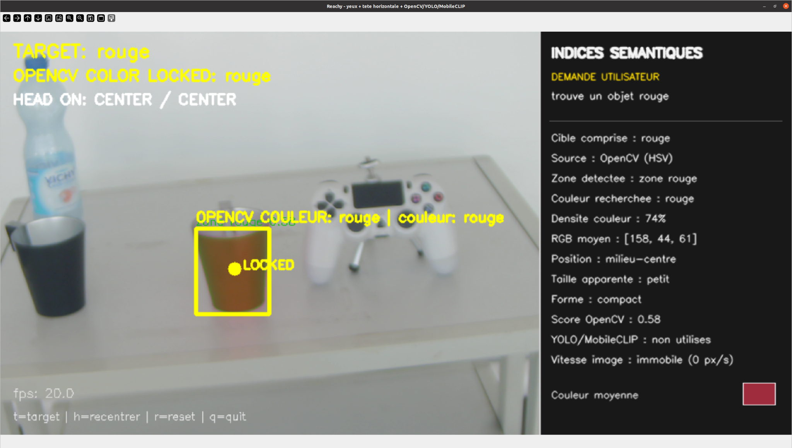
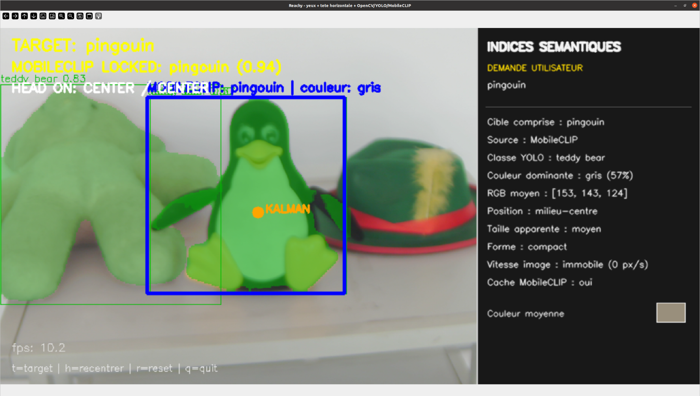
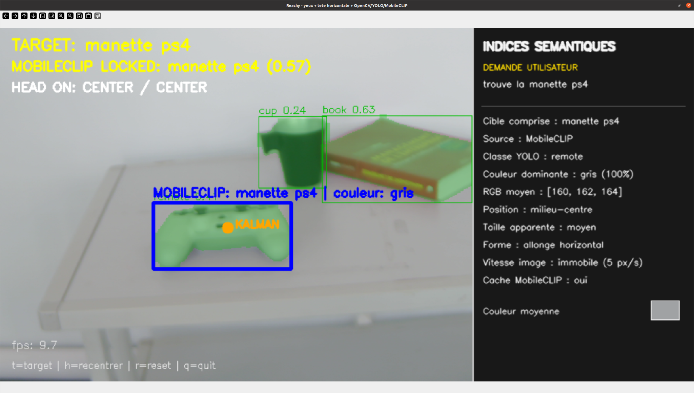
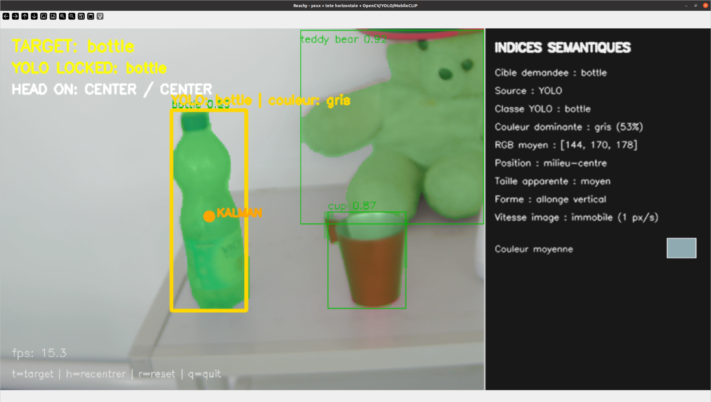
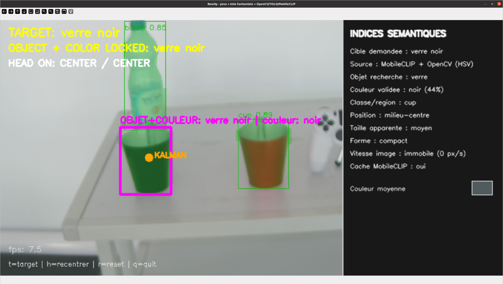
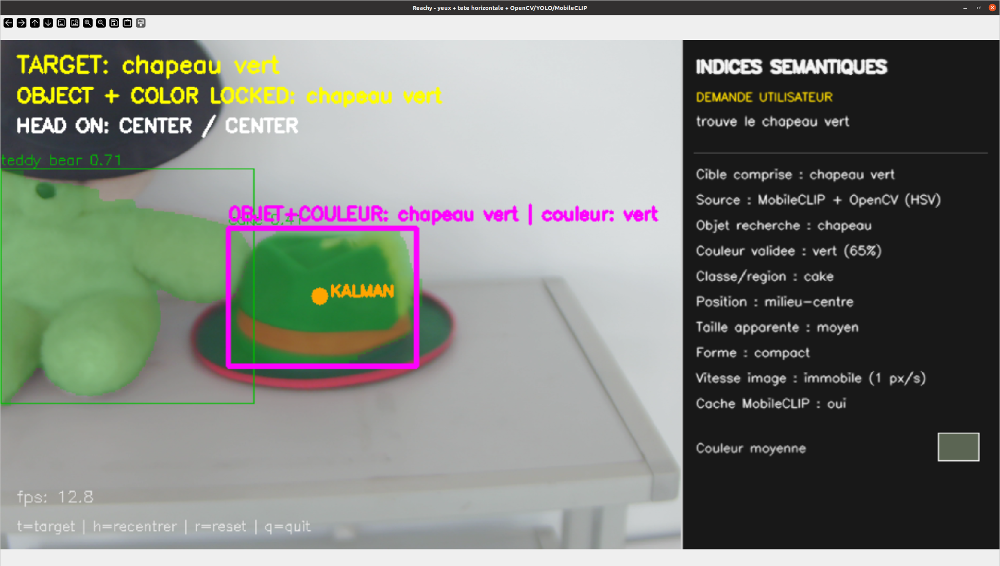

# Reachy Semantic Vision

Module de perception visuelle et d'interaction robotique développé dans le cadre d'un stage de Master 1 en Systèmes intelligents.

Le projet permet à **Reachy 2019** de rechercher une cible dans le flux vidéo, d'en extraire des indices sémantiques, puis de suivre cette cible avec les yeux et une assistance horizontale de la tête.

## Objectifs

Le travail répond à trois objectifs :

1. explorer des méthodes modernes d'extraction d'informations visuelles ;
2. intégrer ces méthodes dans une boucle temps réel ;
3. utiliser les informations extraites pour produire une première interaction entre la perception et les mouvements de Reachy.

## Fonctionnalités principales

Le programme gère trois types de requêtes :

- **couleur seule**, par exemple `rouge` ou `vert` ;
- **objet seul**, par exemple `bottle`, `pingouin` ou `manette ps4` ;
- **objet associé à une couleur**, par exemple `chapeau vert` ou `verre noir`.

Le panneau latéral affiche notamment :

- la demande exacte de l'utilisateur ;
- la cible comprise par le programme ;
- la méthode utilisée ;
- la classe ou région proposée par YOLO ;
- la couleur dominante ou validée ;
- la position dans l'image ;
- la taille et la forme apparentes ;
- la vitesse apparente ;
- l'état du cache MobileCLIP.

## Architecture du pipeline

```text
Caméra des yeux Reachy
        |
        v
Analyse de la requête utilisateur
        |
        +--> Couleur seule
        |      OpenCV + espace HSV
        |
        +--> Objet connu par YOLO
        |      YOLO segmentation
        |
        +--> Objet libre / hors vocabulaire
        |      YOLO segmentation + MobileCLIP
        |
        +--> Objet + couleur
               OpenCV HSV + YOLO/MobileCLIP
        |
        v
Sélection de la cible
        |
        v
Filtre de Kalman
        |
        v
Indices sémantiques + suivi des yeux/tête
```

### Couleur seule

Une requête telle que `rouge` utilise uniquement OpenCV et les plages HSV. YOLO et MobileCLIP ne sont pas exécutés dans ce mode.

### Objet seul

YOLO fournit des boîtes et des masques de segmentation. Lorsque le mot demandé ne correspond pas directement à une classe YOLO, MobileCLIP compare la requête textuelle aux régions proposées.

### Objet et couleur

Pour une requête comme `chapeau vert`, OpenCV valide la couleur tandis que YOLO et MobileCLIP servent à identifier l'objet correspondant.

### Stabilisation et interaction

Le centre de la cible est stabilisé avec un filtre de Kalman. L'erreur entre ce centre et le centre de l'image est ensuite transformée en commandes pour les yeux. La tête peut compléter lentement le mouvement horizontal. Le mouvement vertical de la tête reste désactivé.

## Résultats

Les captures suivantes proviennent de tests réalisés avec le flux vidéo de Reachy au laboratoire.

### Détection d'une couleur avec OpenCV



### Recherche open-vocabulary avec MobileCLIP





### Détection directe avec YOLO



### Combinaison objet et couleur





D'autres captures sont disponibles dans [`results/images`](results/images).

## Vidéos de démonstration

Deux vidéos réalisées au laboratoire présentent le fonctionnement du système
sur le robot Reachy :

- **Démonstration avec plusieurs objets** : changement de cible, détection,
  segmentation, scan automatique et suivi robotique ;
- **Détection d'un verre noir** : combinaison de la reconnaissance de l'objet,
  de la validation de la couleur et du suivi avec les yeux et la tête.

[Voir les vidéos de démonstration sur Google Drive](https://drive.google.com/drive/folders/11w5OCo-LTouQSaijmMwe6HqfAzWtziK3?usp=sharing)

## Structure du dépôt

```text
reachy-semantic-vision/
├── README.md
├── requirements.txt
├── .gitignore
├── main_reachy.py
├── head_control.py
├── docs/
│   ├── robot_control.md
│   └── results.md
├── experiments/
└── results/
    ├── images/
    └── videos/
```

## Installation

Le programme principal a été utilisé dans un environnement Python 3.10.

```bash
python -m venv .venv
```

Sous Windows :

```powershell
.venv\Scripts\activate
```

Sous Linux :

```bash
source .venv/bin/activate
```

Installation des dépendances principales :

```bash
pip install -r requirements.txt
```

MobileCLIP doit être installé séparément depuis le dépôt officiel d'Apple. Le checkpoint `mobileclip_s2.pt` doit ensuite être placé dans le chemin attendu par le programme ou fourni avec l'option `--checkpoint`.

La procédure détaillée d'installation de MobileCLIP, la création du dossier
des checkpoints et les variantes étudiées sont présentées dans
[`docs/mobileclip_setup.md`](docs/mobileclip_setup.md).

Les poids YOLO et MobileCLIP ne sont pas stockés dans ce dépôt afin d'éviter d'ajouter des fichiers lourds.

## Lancement

### Partie vision sans moteurs

```bash
python main_reachy.py --dry-run
```

### PC Linux relié à Reachy

`main_reachy.py` et `head_control.py` doivent rester dans le même dossier.

```bash
python main_reachy.py
```

Options utiles :

```bash
python main_reachy.py --no-head
python main_reachy.py --camera 1
python main_reachy.py --target "chapeau vert"
python main_reachy.py --checkpoint CHEMIN/mobileclip_s2.pt
```

## Commandes clavier

- `t` : saisir une cible ;
- `p` : rechercher un téléphone ;
- `k` : rechercher un clavier ;
- `b` : rechercher une bouteille ;
- `c` : rechercher une tasse ;
- `h` : recentrer les yeux et la tête puis arrêter la cible ;
- `r` : réinitialiser la cible ;
- `q` : quitter.

## Contrôle de Reachy

Le détail du contrôle des moteurs, des paramètres et de la transformation coordonnées-image vers mouvements est présenté dans [`docs/robot_control.md`](docs/robot_control.md).

## Limites observées

- MobileCLIP introduit une latence perceptible sur CPU.
- Les résultats dépendent de la qualité des régions proposées par YOLO.
- Certaines classes sont mal nommées par YOLO, même lorsque MobileCLIP retrouve correctement l'objet demandé.
- Certaines couleurs sombres nécessitent des seuils HSV adaptés.
- La vitesse affichée est une vitesse apparente dans l'image et peut être influencée par les mouvements de la caméra.
- Le mouvement de la tête est plus lent et doit rester limité.

## Conclusion

Le projet fournit une boucle complète :

```text
requête textuelle
-> perception visuelle
-> segmentation et sélection
-> indices sémantiques
-> stabilisation
-> mouvements des yeux et de la tête
```

Le système montre qu'il est possible de combiner OpenCV, YOLO, MobileCLIP et un filtre de Kalman pour obtenir une perception sémantique en temps réel sur Reachy.

## Remarque sur `head_control.py`

Le pipeline principal a été validé au laboratoire avec l'interface de contrôle Dynamixel utilisée sur Reachy. Le fichier `head_control.py` présent dans ce dépôt est une reconstruction compatible fondée sur la configuration et les fonctions utilisées par le programme principal. L'ancien fichier exact n'étant plus disponible, cette distinction est conservée explicitement dans la documentation.
